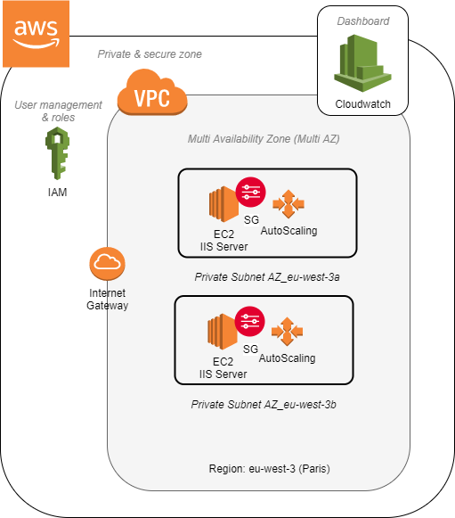
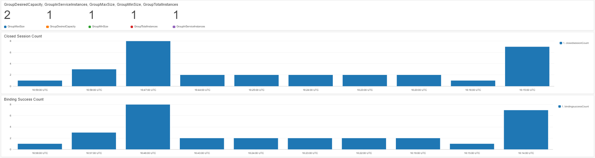

# Deploying a scalable and highly available STUN Server architecture

Stun server deployment on AWS using Terraform

Contents
  - [Architecture](#architecture)
  - [Requirements](#requirements)
  - [Usage](#usage)
    - [Stun Server](#stun-server)
    - [Scalability](#scalability)
    - [Availability](#availability)
    - [Monitoring and Metrics](#monitoring-and-metrics)
  - [Testing](#testing)
  - [Structure](#structure)
  - [Questions](#questions)
    - [How long did it take you to complete this assignment?](#how-long-did-it-take-you-to-complete-this-assignment)
    - [What would you do, if you had more time?](#what-would-you-do-if-you-had-more-time)
    - [What is your feedback on the assignment?](#what-is-your-feedback-on-the-assignment)

## Architecture



This deployment makes use of the services within the AWS cloud computing environment. The main services include:

- EC2: Allows to create the virtual machines or instances, such as those that will serve as STUN servers
- VPC: Allows to create a secure, private network environment to interconnect services and resources on AWS
- IAM: Service that allows to create, manage and define policies for users and services alike, in relation of the resources on AWS that it may or not be able to access

Security oriented features and services that will be put in place for the deployment of the architecture include:

- Security Groups: This feature is comparable to firewalls, as they allow to configure traffic rules based on certain parameters such as origin/source IP addresses, network protocols, instance and interfaces, etc. Security Groups (SG) function at instance/resource level

Scalability is also another important feature of the architecture. Features that allow to achieve scalability include:

- Adjusting deployment scale via Terraform
- Auto-scaling groups: Allows to set automatic horizontal scaling strategies for EC2 instances. The strategies may be based on utilization metrics, network metrics, events, etc

Also, availability is achieved by profiting of the multi Availability Zone (multi-AZ) features of AWS. These strategies include: 

- Replication of instances/service features on at least 2 subnets/AZ
- Auto-scaling group minimum and desired capacity settings.

Lastly, monitoring of the application performance and the infrastructure as whole is also possible through the following services:

- CloudWatch: Monitors the STUN server logs, allows the creation of performance metrics based on logs as well as providing tools to design dashboards for better visualization. Can also be used to monitor performance (i.e. CPU, Network, Disk, Status Checks, etc).

## Requirements

- An AWS Account
- Terraform version > 12.0

For more details on how to access your AWS account to provision resources using Terraform, please check <https://registry.terraform.io/providers/hashicorp/aws/latest/docs>

## Usage

- Configure your access to AWS/Credentials. e.g. Install the AWS CLI tool and configure a user with the proper role. By default, terraform will read credentials from the profile configured using the AWS CLI. You can configure the AWS CLI as follows:

```bash
aws configure
```

- Then, you can get started with the following:

```bash
git clone https://github.com/jdanml/task-stun.git  
terraform init
terraform plan
terraform apply
```

- If you want to delete all resources, use the following:

```bash
terraform destroy
```

- There are two branches in this repo, "main" and "autoscale". To switch and use the autoscale branch use:

```bash
git checkout autoscale
```

## Structure

```
    .
    ├── modules                 # Terraform modules
    │   ├── cloudwatch          # Module defining the Cloudwatch dashboard used for monitoring
    │   ├── ec2-keypair         # Create a public and private key pair. The key pair is used for SSH coonections to EC2 instances
    │   ├── iam                 # Role and policies allowing to collect Cloudwatch metrics from EC2 instances
    │   └── vpc                 # Module defining all the required network-related resources
    ├── user-data               # Contains the initialization script to be used by EC2 instances
    ├── main.tf                 # Main terraform file. References all other modules and creates the compute related recources
    ├── output.tf               # Shows values related to defined variables as output after the deployment
    ├── README.md               # This file
    ├── terraforms.tfvars       # Contains value assignments to variables referenced on main.tf
    └── variables.tf            # Defines variables used on main.tf
```

## Considerations

### Stun Server

The STUN server implementation used for this deployment is Coturn <https://github.com/coturn/coturn>. Coturn is an "open source implementation of TURN and STUN Server".

Coturn is rather easy to setup and use. It also comes with handy configuration options, such as running as a daemon service on the background and log retention, the latter being crucial for monitoring purposes.

Coturn is installed via the user data script. I figured out this would be a good way of doing so, as we need to obtain both the public and private IP addresses of the instance and write them to the configuration file needed by the application. Taking into account that every new instance will have different IPs,the script requests the IP addresses from their respective metadata URLs and then writes the configuration file.

> When it comes to security groups for the EC2 instances, ports 3478, 5349 and 22 (for SSH) are the only ones accepting incoming connections.

> For TLS functionality (port 5349), it is necessary to generate TLS certificates. It is possible to create self-signed certificates (<https://support.sonus.net/display/WSXDOC12/Self-signed+Certificates+for+Turn+Server>) 

### Scalability

#### Horizontal

At first I thought that defining a variable within terraform for the number of STUN servers to deploy and keeping the terraform state would be enough. This ensures availability and its easy to understand (you'll only need to modify the values of the variable "aws_stun_server_num " on the tfvars file) but we can do better. Then, I decided to implement an AWS autoscaling. As the previous solution works ok, I decided to create a bew branch for the autoscaling option.

Auto-scaling brings much more benefits to the deployment, such as:

- Dynamic provisioning of instances.
- Ensures a minimum capacity for the deployment. In other words, allows us to define the least number of instances we want to have at a time. This is an amazing feature in relation to fault tolerance.
- Scales up or down based on certain criteria. On this deployment, I defined a criteria to scale up if CPU utilization of all active instances reaches 80 % and scale down if it reaches 10 %.
- New metrics, related to the quorum of our deployment, are available.

#### Vertical

We can do this by simply modifying the value of the "aws_stun_size" variable. We can go from t2.micro to t2.medium, for example, and then re-apply the terraform script.

### Availability

Two subnets on different Availability Zones or AZs are created. In other words, we have a subnet in, let's say, eu-west-3a and another in eu-west-3b.

> I chose the eu-west-3 AWS region (Paris) for this deployment. Any other region can be used for this deployment.

Then, we need to make sure that instances are being deployed in different subnets. We do this as follows:

- In the "static" deployment (this is, the one without auto-scaling) we provide the subnets as a list. Then, by using the element function on this list alongside the count index of the instance, one of the subnets is picked. This ensures that the new instance will always be launched in a different subnet. If the count index is greater than the number of items in the list, the index is wrapped around.
- In the autoscale branch, we make it so that the autoscaling group is multi AZ (uses the subnets created before on different AZs)

### Monitoring and Metrics

Monitoring is achieved with the Cloudwatch AWS service. In order to setup this functionality, it is required to:

- Define an IAM role to allow EC2 instances to publish metrics and log data on Cloudwatch.
- Install and configure the Cloudwatch agent on the instances. Similarto Coturn, this installation also takes places during the user data script execution.

Based on the logs created by Coturn, I created two custom metrics on Cloudwatch:

- Number of closed sessions.
- Number of successful binding requests between the STUN client and the STUN server. This is the process in which the server communicates the client the IP address and port from which the request came from. This IP address and port is the one given to the client by a NAT.

I coupled the previous two metrics with metrics from the autoscaling group, more specifically:

- Group Max Size
- Group Desired Capacity
- Group Min Size
- Group Total Instances
- Group In Service Instances

In order to create the following dashboard:



## Testing

To test the deployment, I did the following:

- Go to: <https://webrtc.github.io/samples/src/content/peerconnection/trickle-ice/>

- Add the server with the following parameters:
  - STUN or TURN URI: stun:<public_ip>:3478
  - TURN username: task
  - TURN password: pass123

- Click on "Add Server"

- Then click on the "Gather Candidates" button, at the bottom of the page.

- Wait around 5 mins, and then check the "Closed Session Count" and "Binding Success Count" graphs showing new values.

## Questions

### How long did it take you to complete this assignment? 

A week. The bulk of the work was done during the weekend though. I spend the previous days thinking and designing the deployment.

### What would you do, if you had more time?

- Proposing a POC based on this architecture (A WebRTC based application...)
- Proposing a solution based on an alternative platform: K8s, Openstack or both.

### What is your feedback on the assignment?

Overall, I liked it a lot! I liked the freedom and taking my own assumptions
